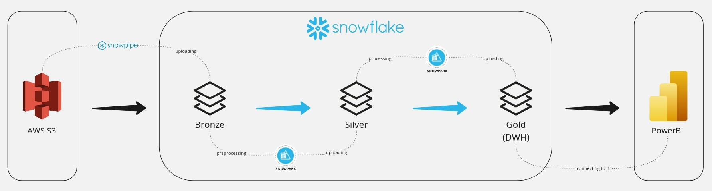

# Snowflake DWH

## Project description

This project is for educational purposes only. 

The aim of this project was to show the real-world example of Medalion Architecture using technologies like AWS S3, Snowflake (Snowpipe, Snowpark) and PowerBi.

- The initial raw data is stored in S3 bucket;
- The raw data was auto-copied from S3 bucket into Snowflake's Bronze layer using Snowpipe;
- Three layers are being created on Snowflake DWH:
  - Raw layer which is dedicated to store the raw data,
  - The cleaned data is stored on Silver layer,
  - Aggregated data marts are located on Gold layer;
- All the data is processed by Snowpark;
- The business oriented reports have been created in PowerBi.

Accounts and permissions are managed using AWS IAM and Snowflake by attaching policies to them. Policies define what actions the user is allowed or denied to perform on project resources.
## Infrastructure

- AWS S3;
- Snowflake (Snowpipe, Snowpark);
- Power BI.

**Here is the architecture of the project:**  

## Usage
The usage of this project is divided by the following logical blocks:

### Storing the raw data in AWS S3
To check the raw data in AWS S3 you can perform the following steps:

1) Open [AWS](https://signin.aws.amazon.com/signin?redirect_uri=https%3A%2F%2Fconsole.aws.amazon.com%2Fconsole%2Fhome%3FhashArgs%3D%2523%26isauthcode%3Dtrue%26nc2%3Dh_ct%26src%3Dheader-signin%26state%3DhashArgsFromTB_eu-north-1_f6f179a494940e97&client_id=arn%3Aaws%3Asignin%3A%3A%3Aconsole%2Fcanvas&forceMobileApp=0&code_challenge=K4IISJ3JpAMhJ0G0fgI6mK1IuIWFKx4-rPZzwuhXb68&code_challenge_method=SHA-256) and log in, after find S3 service;
2) Press the snowflake-bucket324324;
3) In the folder "olist" there are folders for each datasets.

### Snowflake DWH 
To check the procedures and results, you need to open the [Snowflake](https://ht39113.eu-central-1.snowflakecomputing.com/oauth/authorize?client_id=5d3PEBPTev7fwUYLTPgVbCxnGg6emA%3D%3D&display=popup&redirect_uri=https%3A%2F%2Fapps-api.c1.eu-central-1.aws.app.snowflake.com%2Fcomplete-oauth%2Fsnowflake&response_type=code&scope=refresh_token&state=%7B%22browserUrl%22%3A%22https%3A%2F%2Fapp.snowflake.com%2F%22%2C%22csrf%22%3A%2218ba87ad%22%2C%22isSecondaryUser%22%3Afalse%2C%22oauthNonce%22%3A%225mw3j66lfGW%22%2C%22url%22%3A%22https%3A%2F%2Fht39113.eu-central-1.snowflakecomputing.com%22%2C%22windowId%22%3A%22004b053d-710d-4756-9d3f-0fcde78577fa%22%7D):

1) Log in using credentials for Snowflake;
2) To run all procedures you can open worksheet, select "RUN PIPELINE" and write there "call RUN_PIPELINE();".  
When the pipeline has finished (it takes approximately 1 min), you can view the result of all transformations in Snowflake;
3) Press the tab Data -> Databases -> Project to view the result.

**The Snowflake DWH consists of 3 different layers:**
1) Bronze layer for raw 1 to 1 data coming from S3 bucket. No transformations and no cleansing whatsoever. Just an entry point for the data;
2) Silver layer is where all the transformations and cleansing took place. Everything related to formatting, datatypes and so on was figured out here;
3) Gold layer is where was added a generated time-series table and performed transformations and joins in order to satisfy the business requirements. Of course, taking into account that this is a test task and there are no business requirements, was tried to create meaningful transformations and prepare the dataset for the visualization stage, creating a kind of a data mart. I’d like to mention that could have taken another approach here, creating a more general layer of data and then building a data mart on top of them, but taking time into account was chose a more democratic approach.

### PowerBI dashboards
The business oriented reports with different kind of dashboards are located [here](olist_sales_report.pdf). 

It consists of 4 tabs: “Overview” with basic information about the dataset and three tabs dedicated specifically to exploring dimensions of the data mart. I focused on sellers, customers & products and named tabs of the dashboard accordingly.

Here is the source _.pbix_ file: [link to the dashboard](https://drive.google.com/file/d/1emvLyW1Vzh08HxR3vK6EGp4j8dFCjjy0/view?usp=drive_link)
